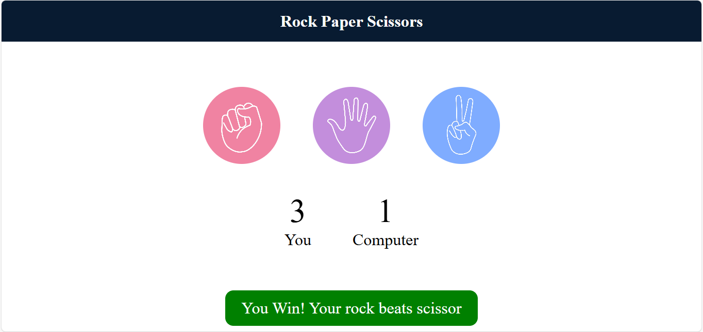

# 🎮 Rock Paper Scissors – Web Game

A simple and interactive **Rock Paper Scissors** game built using **HTML, CSS, and JavaScript**.  
This project was created to practice front-end fundamentals such as DOM manipulation, event handling, and basic game logic.

---

## 📸 Screenshot



---

## ✨ Features
- Player vs Computer gameplay
- Randomized computer moves
- Live score tracking
- Win / Lose / Draw result display
- Clean and responsive UI

---

## 🛠️ Technologies Used
- **HTML** – Structure of the web page  
- **CSS** – Styling and layout  
- **JavaScript** – Game logic and interactivity  

---

## 🎯 Learning Outcomes
- Understanding DOM manipulation
- Handling user click events
- Implementing conditional logic
- Building a small interactive web application

---

## 🚀 How to Run
1. Clone the repository  
   ```bash
   git clone https://github.com/Nikhildev-17/Rock-Paper-Scissor.git
   ```

